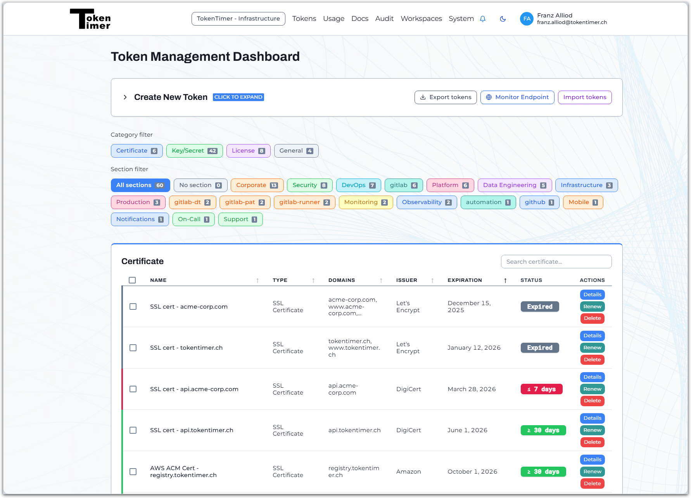
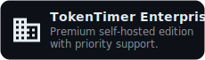
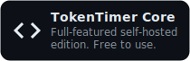

  

<h3 align="center">The token, certificate, license, and secret expiration manager for teams.</h3>

  <b>
  <a href="#introducing-tokentimer">Introducing</a> &bull;
  <a href="#get-started">Get Started</a> &bull;
  <a href="#documentation">Docs</a> &bull;
  <a href="#contributing">Contributing</a> &bull;
  <a href="#reporting-a-security-issue">Security</a> &bull;
  <a href="#license">License</a>
  </b>

 

---

 

# Introducing TokenTimer

Operational incidents caused by expired assets are still a recurring problem. Certificates expire, API keys get rotated, secrets are forgotten, and renewal ownership is often unclear. Most systems expose expiration data inconsistently, offer limited notification support, and lack a centralized cross-provider view.

TokenTimer is a security-first expiration manager that aggregates expiring assets across providers and environments into one place. It helps teams monitor certificates, tokens, secrets, licenses, subscriptions, and other time-bound assets through configurable multi-channel alerting and team collaboration workflows.

**What makes TokenTimer different?**

- **Unified expiration visibility:** Track certificates, tokens, secrets, licenses, subscriptions, and other expiring assets across providers and environments in one place.
- **Flexible multi-channel alerting:** Notify teams through email, Slack, Microsoft Teams, Discord, PagerDuty, WhatsApp, and webhooks, with configurable delivery and escalation options.
- **Native integrations, auto-sync, and automated discovery:** Connect TokenTimer to providers like HashiCorp Vault, AWS Secrets Manager, Azure Key Vault, Azure AD, GCP Secret Manager, GitHub, and GitLab to automatically import and keep expiration metadata up to date, while also monitoring HTTPS endpoints for SSL expiry and health.
- **Built for teams and audits:** Organize assets with workspaces, control access with RBAC, and keep an audit trail of important actions and alert activity.
- **Security-first by design:** TokenTimer stores expiration metadata, ownership, and status information without storing secret values or private keys.

  

 

---

 

# Get Started

<a href="https://tokentimer.ch">
<picture>
  <source media="(prefers-color-scheme: dark)" srcset="docs/assets/readme/tokentimer-cloud-cta.svg">
  <source media="(prefers-color-scheme: light)" srcset="docs/assets/readme/tokentimer-cloud-cta.svg">
  
</picture>
</a>
&nbsp; &nbsp;
<a href="https://tokentimer.ch/pricing">
<picture>
  <source media="(prefers-color-scheme: dark)" srcset="docs/assets/readme/tokentimer-enterprise-cta.svg">
  <source media="(prefers-color-scheme: light)" srcset="docs/assets/readme/tokentimer-enterprise-cta.svg">
  
</picture>
</a>
&nbsp; &nbsp;
<a href="QUICKSTART.md">
<picture>
  <source media="(prefers-color-scheme: dark)" srcset="docs/assets/readme/tokentimer-core-cta.svg">
  <source media="(prefers-color-scheme: light)" srcset="docs/assets/readme/tokentimer-core-cta.svg">
    
</picture>
</a>
 

### Run it on your own server

|  |  |  |
|:--:|:--:|:--:|

 

# Documentation

| | |
|---|---|
| [QUICKSTART.md](QUICKSTART.md) | Step-by-step setup guide |
| [docs/CONFIGURATION.md](docs/CONFIGURATION.md) | Full environment variables reference |
| [docs/AUTHENTICATION.md](docs/AUTHENTICATION.md) | Auth model, admin bootstrap, invitations, RBAC |
| [deploy/helm/README.md](deploy/helm/README.md) | Helm chart installation and configuration |
| [apps/worker/queue-architecture.md](apps/worker/queue-architecture.md) | Alert queue and worker design |
| [CHANGELOG.md](CHANGELOG.md) | Release notes |
| [ROADMAP.md](ROADMAP.md) | Engineering roadmap and metrics |

 

# Contributing

We welcome contributions. Start by reading the documentation above and exploring the codebase. Join the discussions on [GitHub Issues](https://github.com/tokentimerch/tokentimer-core/issues) for feature requests, bug reports, and questions.

 

# Reporting a security issue

If you've found a security-related issue with TokenTimer, please email [support@tokentimer.ch](mailto:support@tokentimer.ch). Submitting to GitHub makes the vulnerability public, making it easy to exploit. We'll do a public disclosure of the security issue once it's been fixed.

After receiving a report, TokenTimer will take the following steps:

- Confirmation that the issue has been received and that it's in the process of being addressed.
- Attempt to reproduce the problem and confirm the vulnerability.
- Prepare a patch/fix and associated automated tests.
- Release a new version of all affected versions.
- Prominently announce the problem in the release notes.
- If requested, give credit to the reporter.

 

# License

This project is licensed under the [Business Source License 1.1](LICENSE) with an Additional Use Grant that permits production use for your organization's internal purposes. You may self-host, modify, and integrate TokenTimer freely. The only restriction is offering it as a competing hosted or managed service.

Each release converts to [AGPLv3](https://www.gnu.org/licenses/agpl-3.0.html) four years after its publication date.

For commercial licensing or questions, contact [support@tokentimer.ch](mailto:support@tokentimer.ch).

"TokenTimer" is a trademark of Franz ALLIOD, on behalf of TokenTimer Sàrl (in formation), Switzerland.
