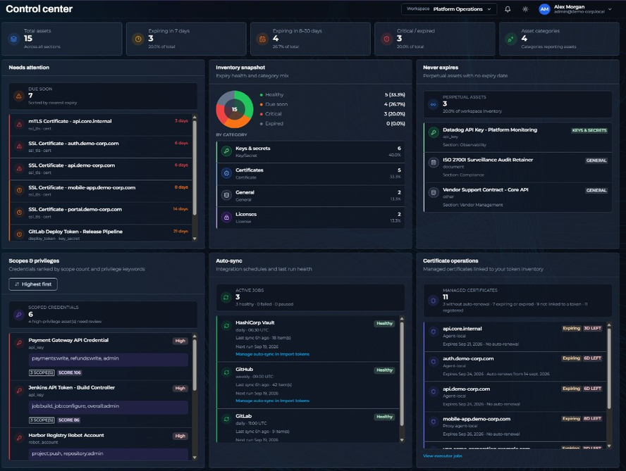
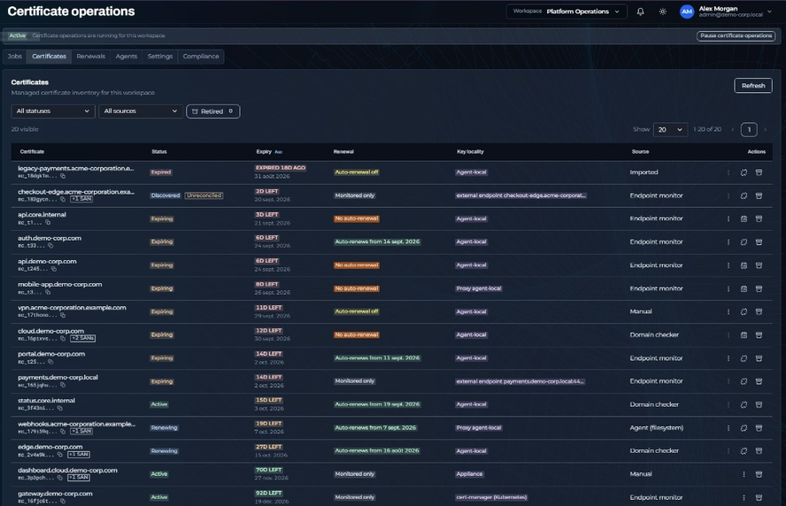
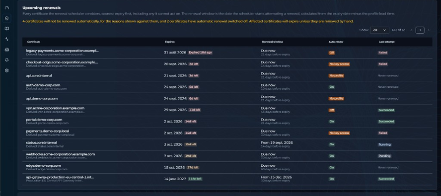
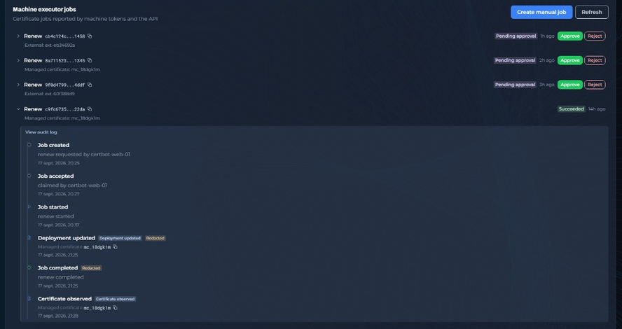
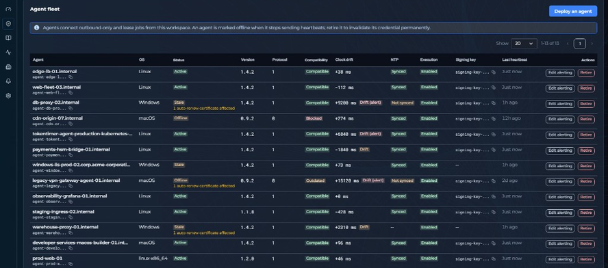
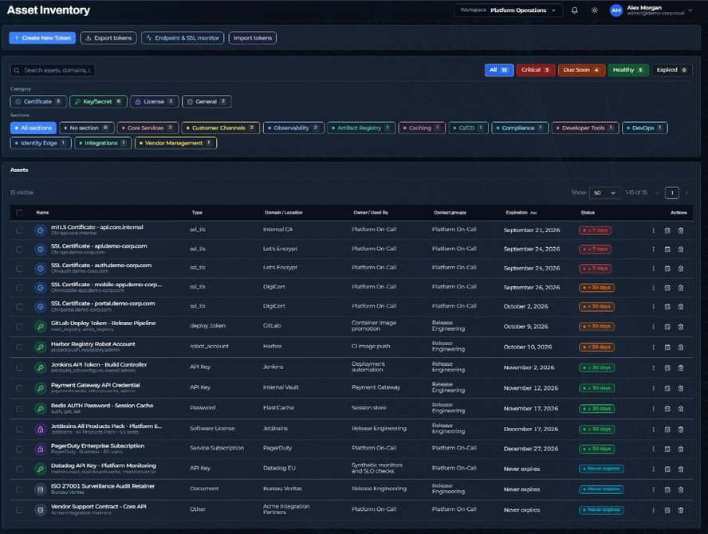
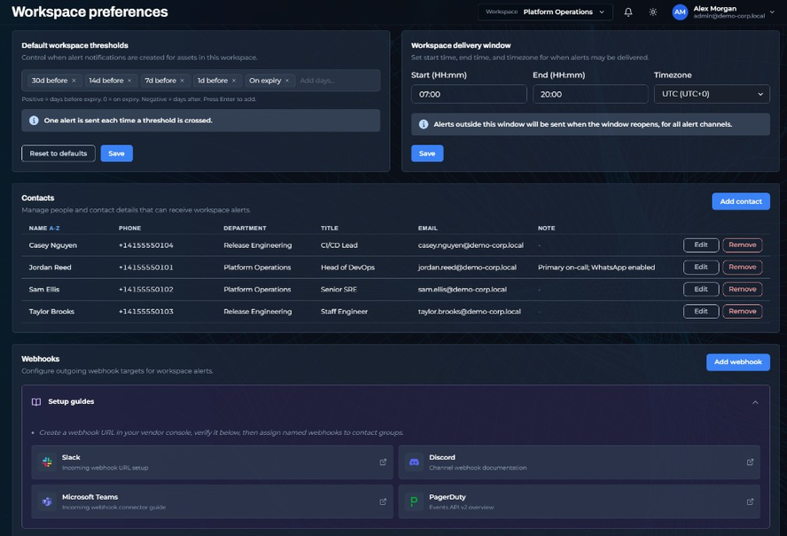
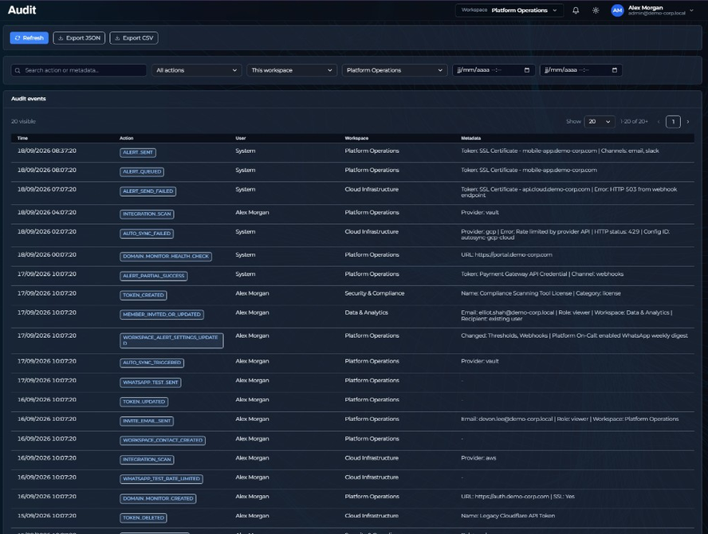

  

<h3 align="center">The open-source token, certificate, license, and secret expiration manager for teams.</h3>

  
  

  
  
  

  
  
  
  
  
  
  
  

  <b>
  <a href="#introducing-tokentimer">Introducing</a> &bull;
  <a href="#get-started">Get Started</a> &bull;
  <a href="#documentation">Docs</a> &bull;
  <a href="#contributing">Contributing</a> &bull;
  <a href="#reporting-a-security-issue">Security</a> &bull;
  <a href="#license">License</a>
  </b>

 

---

 

# Introducing TokenTimer

Operational incidents caused by expired assets are still a recurring problem. Certificates expire, API keys get rotated, secrets are forgotten, and renewal ownership is often unclear. Most systems expose expiration data inconsistently, offer limited notification support, lack a centralized cross-provider view, and leave renewal as manual, error-prone work.

TokenTimer is a security-first expiration manager that aggregates expiring assets across providers and environments into one place, and goes beyond visibility: with certificate operations (CertOps) enabled, it automates renewal, deployment, and verification end to end so certificates stop expiring in the first place. Alongside automation, teams get multi-channel alerting and collaboration workflows for everything else that expires: tokens, secrets, licenses, and subscriptions.

  

## What makes TokenTimer different?

### End-to-end certificate automation (CertOps)

An outbound-only agent renews, deploys, reloads, and verifies certificates on your infrastructure (ACME via certbot/acme.sh, DNS-01 across major providers, atomic rollback), with approval gates, a kill switch, and renewal-failure alerts keeping humans in control. It also distributes and revokes internal CA trust anchors in machine trust stores on Windows, Debian/Ubuntu, and RHEL/Fedora. cert-manager and machine-token executors are supported too. The control plane never receives or stores private key material. [Watch the demo](https://www.youtube.com/watch?v=1BpcL9myKwc).

  

<table align="center">
  <tr>
    <td align="center" width="33%" valign="top">
      
       Upcoming renewals and profiles
    </td>
    <td align="center" width="33%" valign="top">
      
       Executor jobs with approval gates and timeline evidence
    </td>
    <td align="center" width="33%" valign="top">
      
       Agent fleet health
    </td>
  </tr>
</table>

### Unified expiration visibility

Track certificates, tokens, secrets, licenses, subscriptions, and other expiring assets across providers and environments in one place. Filter by category, section, owner, or urgency, and see at a glance what expires next.

  

### Flexible multi-channel alerting

Notify teams through email, Slack, Microsoft Teams, Discord, PagerDuty, WhatsApp, and webhooks, with configurable delivery and escalation options.

  

### Native integrations, auto-sync, and automated discovery

Connect TokenTimer to providers like HashiCorp Vault, AWS Secrets Manager, Azure Key Vault, Azure AD, GCP Secret Manager, GitHub, and GitLab to automatically import and keep expiration metadata up to date, discover public subdomains for SSL certificate imports, and monitor HTTPS endpoints for SSL expiry and health.

  

### Built for teams and audits

Organize assets with workspaces, control access with RBAC, and keep an audit trail of important actions and alert activity. Approvals are bound by hash to the exact job that runs, and each renewal step records its own evidence, so the trail shows who approved what and how the result was verified. [Watch the dashboard walkthrough](docs/assets/dashboard-overview.gif).

  

### Security-first by design

TokenTimer stores expiration metadata, ownership, and status information without storing secret values or private keys. Integration scan credentials are discarded after one-off imports; if you enable auto-sync, they are encrypted at rest in the database for scheduled re-scans.

 

---

 

# Get Started

|  |  |  |
|:---:|:---:|:---:|

### Run it on your own server

|  |  |  |
|:--:|:--:|:--:|

 

# Documentation

| | |
|---|---|
| [QUICKSTART.md](QUICKSTART.md) | Step-by-step setup guide |
| [DEVELOPMENT.md](DEVELOPMENT.md) | Local development, worker runner, and cron scheduling |
| [docs/CONFIGURATION.md](docs/CONFIGURATION.md) | Environment variables and Vault AppRole inventory authentication |
| [docs/certops/CONTEXT.md](docs/certops/CONTEXT.md) | Certificate operations (CertOps) domain model and behavior |
| [docs/certops/agent.md](docs/certops/agent.md) | TokenTimer Agent: install, config, policy, DNS-01 providers, ACME, deploy, verification, and trust-anchor (CA) distribution/revocation |
| [docs/certops/executor-api.md](docs/certops/executor-api.md) | Machine API tokens and executor job API for external renewal tooling |
| [docs/AUTHENTICATION.md](docs/AUTHENTICATION.md) | Auth model, admin bootstrap, invitations, RBAC |
| [deploy/helm/README.md](deploy/helm/README.md) | Helm chart installation and configuration |
| [apps/worker/queue-architecture.md](apps/worker/queue-architecture.md) | Alert queue and worker design |
| [CHANGELOG.md](CHANGELOG.md) | Release notes |
| [ROADMAP.md](ROADMAP.md) | Engineering roadmap |
| [https://tokentimer.ch/docs](https://tokentimer.ch/docs) | Online user docs (self-hosted and cloud; Certificates at [/docs/certificates](https://tokentimer.ch/docs/certificates)) |

**Worker deployment:** Docker Compose runs one worker type per container. The
worker image default command runs all workers in one process (`runner.js all`).
See [DEVELOPMENT.md](DEVELOPMENT.md) for scheduling, timezones, and observability.

 

# Contributing

We welcome contributions. Start by reading the documentation above and exploring the codebase. Join the discussions on [GitHub Issues](https://github.com/tokentimerch/tokentimer-core/issues) for feature requests, bug reports, and questions.

 

# Reporting a security issue

If you've found a security-related issue with TokenTimer, please email [support@tokentimer.ch](mailto:support@tokentimer.ch). Submitting to GitHub makes the vulnerability public, making it easy to exploit. We'll do a public disclosure of the security issue once it's been fixed.

After receiving a report, TokenTimer will take the following steps:

- Confirmation that the issue has been received and that it's in the process of being addressed.
- Attempt to reproduce the problem and confirm the vulnerability.
- Prepare a patch/fix and associated automated tests.
- Release a new version of all affected versions.
- Prominently announce the problem in the release notes.
- If requested, give credit to the reporter.

 

# License

This project is licensed under the [GNU Affero General Public License v3.0 (AGPLv3)](LICENSE). TokenTimer Core is open source: you may self-host, modify, and integrate it freely. If you run a modified version as a network service, you must make the corresponding source available to its users under the same license.

A commercial license without AGPL's source-disclosure obligations is available for organizations that want to embed or redistribute TokenTimer Core without those terms. Contact [support@tokentimer.ch](mailto:support@tokentimer.ch).

"TokenTimer" is a trademark of Tokentimer Sàrl, Switzerland.
